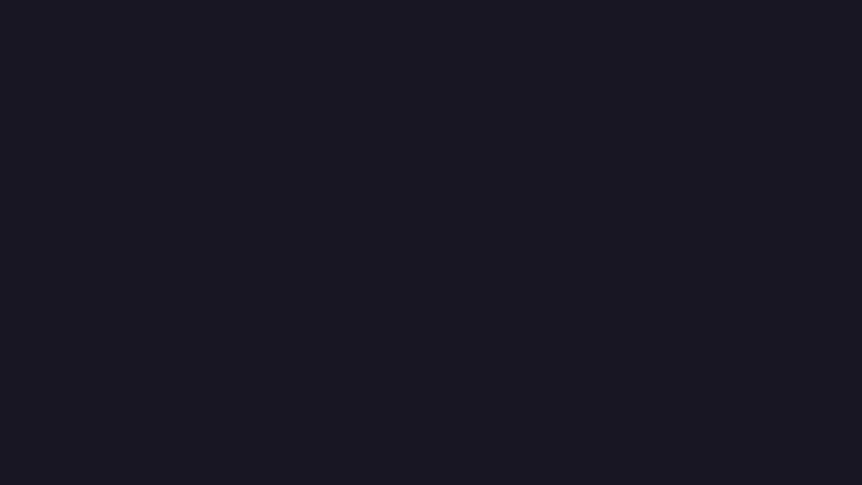

# reelme

**Your README, but as a video.**

`reelme` is an agent skill that generates animated explainer videos for open-source projects. Point it at any repo, answer a few questions, and get an MP4 and a GIF ready to drop into your README, socials, or landing page.



---

## Install

```bash
npx skills add RubenGlez/reelme
```

This installs the `/reelme` skill via [skills.sh](https://skills.sh) into any compatible agent: Claude Code, Cursor, Gemini CLI, OpenAI Codex, and any other [Agent Skills](https://agentskills.io)-compatible tool.

**Requirements:** Node.js >=18, pnpm

---

## Usage

Open your agent inside any repo and run:

```
/reelme
```

The agent will:
1. Ask whether this is a **project intro** or a **feature announcement**
2. Read your repo and pre-fill everything it can infer
3. Ask only about the gaps (brand color, logo, anything uncertain)
4. Scaffold a Remotion project and render your video locally

Output lands at `video/out/video.mp4` and `video/out/video.gif` by default.

---

## Two modes

**Project intro:** run once per project. The agent reads your README and source files, figures out what makes it worth using, and builds a full explainer.

**Feature announcement:** run after a release. The agent reads your changelog and recent git history, focuses on what changed and why it matters, and keeps your existing brand.

---

## Scene types

| Scene | What it shows |
|---|---|
| `problem` | The pain your project solves, or a release headline |
| `feature-list` | Key features or changes, revealed one by one |
| `code-reveal` | A code snippet typing itself in, key line highlighted |
| `terminal` | Commands running, output appearing progressively |
| `data-flow` | Nodes and arrows showing how data moves through your system |
| `split` | Before/after contrast, great for DX improvements |
| `browser` | A mock browser window with your URL or a screenshot |
| `cta` | Install command and repo URL |

The agent picks the right scenes for your project. You can also edit `video/src/brief.json` directly and re-run `pnpm render` to tweak without restarting the interview.

---

## Customization

Everything is driven by `video/src/brief.json`. After the first render, edit it and run:

```bash
cd video && pnpm render
```

The Remotion source is yours to adjust: timing, copy, colors, scenes.

---

## License

MIT
