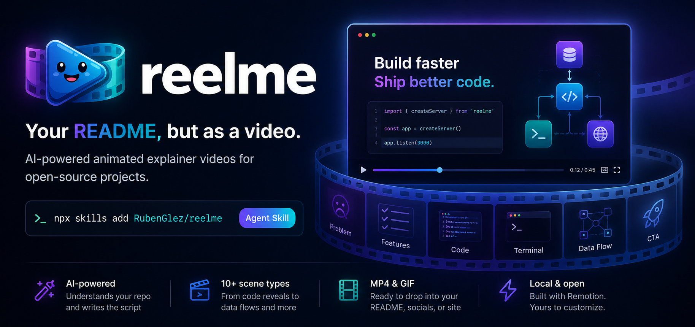
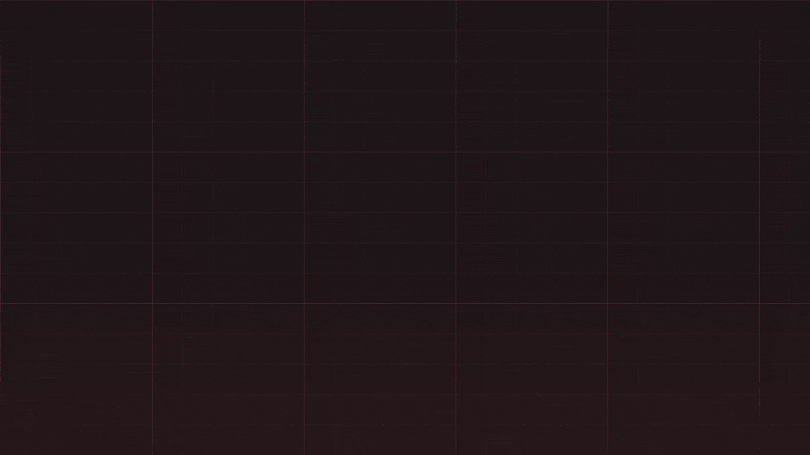

`reelme` is an agent skill that generates launch videos for any dev project. Point it at any repo, answer a few questions, and get platform-ready MP4s and GIFs for socials, your README, and release announcements.



<sub>A launch video for [ripgrep](https://github.com/BurntSushi/ripgrep), generated by running `/reelme` on its repo. See more in the [Gallery](#gallery).</sub>

---

## Install

```bash
npx skills add RubenGlez/reelme
```

Works in any [Agent Skills](https://agentskills.io)-compatible agent: Claude Code, Cursor, Gemini CLI, OpenAI Codex, and more.

**Requirements:** Node.js >=18

The skill invokes the `reelme` CLI automatically. You don't need to install it separately.

---

## Usage

Open your agent inside any repo and run:

```
/reelme
```

The skill reads your repo, interviews you for brand details it can't infer, and writes `reelme.json` at the repo root. That file is your brand memory — commit it so future runs can update rather than start fresh.

Once the brief is ready, the skill runs:

```bash
npx reelme render
```

The CLI scaffolds a Remotion project in `~/.reelme/cache/<project-hash>/` (global cache, never inside your repo), renders all selected platforms, and copies the outputs to `./reelme-out/`.

**Preview before rendering:**

```bash
npx reelme studio
```

Opens Remotion Studio so you can scrub through scenes before committing to a full render.

**Iterate:**

Edit `reelme.json` directly, then re-run:

```bash
npx reelme render
```

**Outputs** land in `reelme-out/`, one file per selected platform: `x.mp4`, `tiktok.mp4`, `github-readme.gif`, etc. Social platforms also get a `<platform>-teaser.mp4` when a teaser cut is defined.

---

## Modes

**Project intro** — run once per project. Reads your README and source files, explains what makes it worth using.

**Feature announcement** — run after a release. Reads your changelog and recent git history, focuses on what changed and why it matters.

**Update existing video** — run `/reelme` again in a repo that already has a `reelme.json`. The skill re-reads the repo, surfaces any drift, and proposes changes to the brief. Only `reelme.json` is updated — no re-scaffold needed.

---

## Gallery

Real launch videos, each generated by running `/reelme` on a well-known open-source project — across different tones, both intro and announcement modes, and every output format. The source brief for each lives in [`gallery/`](./gallery) if you want to see how it was made.

| Project | Tone · Mode | Video |
|---|---|---|
| [ripgrep](https://github.com/BurntSushi/ripgrep) | technical · intro | *(hero, top of page)* |
| [Polars](https://github.com/pola-rs/polars) | technical · intro | [GIF](./gallery/polars/polars.gif) |
| [Hono](https://github.com/honojs/hono) | professional · intro | [GIF](./gallery/hono/hono.gif) |
| [Pake](https://github.com/tw93/Pake) | playful · intro | [GIF](./gallery/pake/pake.gif) |
| [Expo](https://github.com/expo/expo) | professional · intro | [GIF](./gallery/expo/expo.gif) |
| [Bun](https://github.com/oven-sh/bun) | technical · announcement | [GIF](./gallery/bun/bun.gif) |

> These videos were generated with reelme to demonstrate what it produces. reelme is not affiliated with or endorsed by any of these projects; all project names, logos, and trademarks belong to their respective owners.

---

## Scene types

`hook` · `problem` · `feature-list` · `clip` · `code-reveal` · `terminal` · `data-flow` · `split` · `browser` · `stat-callout` · `benchmark` · `file-tree` · `mobile` · `os-window` · `hotkey` · `cta`

Full schema reference: [`skills/reelme/references/scene-schemas.md`](./skills/reelme/references/scene-schemas.md)

---

## License

MIT
